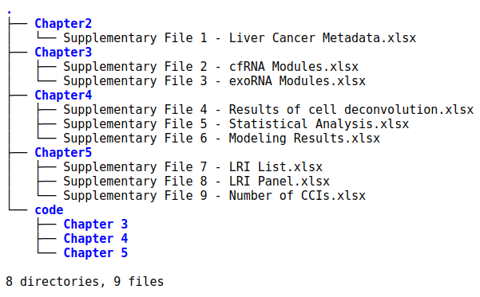

# Thesis Supplementary Material

_____________________________________________

_____________________________________________

This repository contains the suplementary files and the code used to produce the results of the thesis titled "Computational Methods in Cell-Free RNA-Sequencing for Liver Cancer Profiling and Diagnosis" by Aram Safrastyan. 

