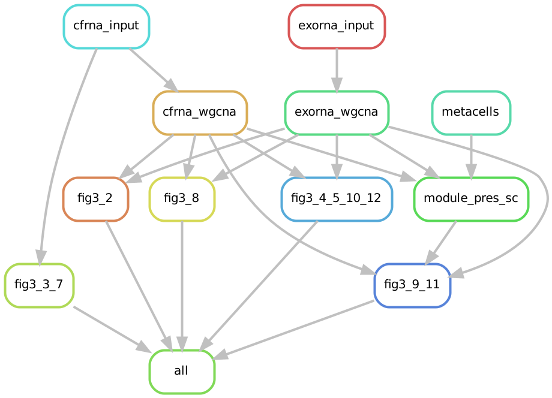

# WGCNA analysis of cfRNA and exoRNA data from liver cancer patients and healthy donors

_____________________________________________

_____________________________________________

This code is aimed at reproducing the results of Chapter 3. 

For full reproducibility, users are advised to first create a conda environment ([How to install mamba](https://mamba.readthedocs.io/en/latest/installation/mamba-installation.html)) with the command **mamba env create --name cfwgcna_lc --file cfwgcna_lc.yml**. This will install the necessary tools with the appropriate versions. Afterwards, the newly created conda environment can be activated with the command **mamba activate cfwgcna_lc** and the snakemake pipeline to reproduce the results can be run via **snakemake -s snakemake_pipeline --cores X** where "X" is the number of cores one wishes to use. Finally, the figure created with the software "Cytoscape" (Figure 3.6) is not reproduced here but if the user desires the figure can be recreated to a reasonable degree using the files in the "cfrna/results/modules/" directory. 

