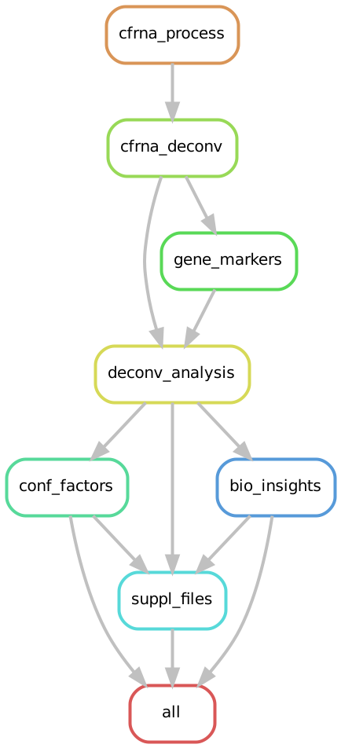

# Cell-free deconvolution analysis of liver cancer patient and healthy donor blood

_____________________________________________

_____________________________________________

This code is aimed at reproducing the results of Chapter 4. 

For full reproducibility, users are advised to first create a conda environment ([How to install mamba](https://mamba.readthedocs.io/en/latest/installation/mamba-installation.html)) with the command **mamba env create --name cfdeconv_lc --file cfdeconv_lc.yml**. This will install the necessary tools with the appropriate versions. Afterwards, the newly created conda environment can be activated with the command **mamba activate cfdeconv_lc** and the snakemake pipeline to reproduce the results can be run via **snakemake -s snakemake_pipeline --cores X** where "X" is the number of cores one wishes to use.

